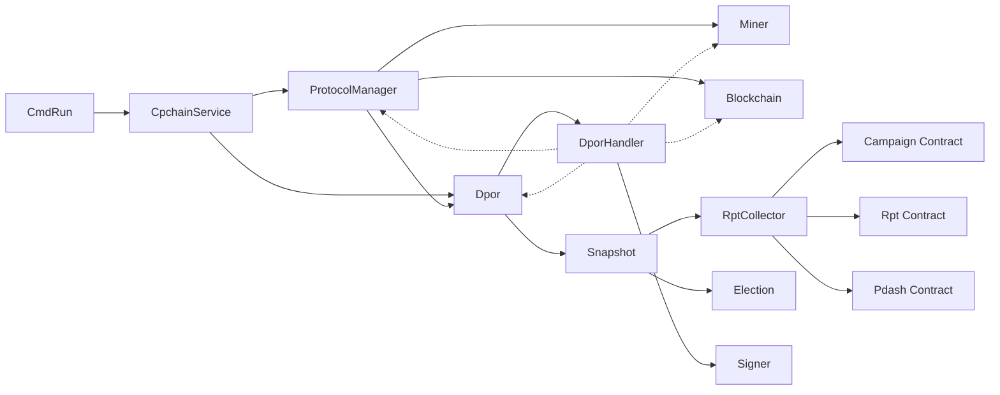
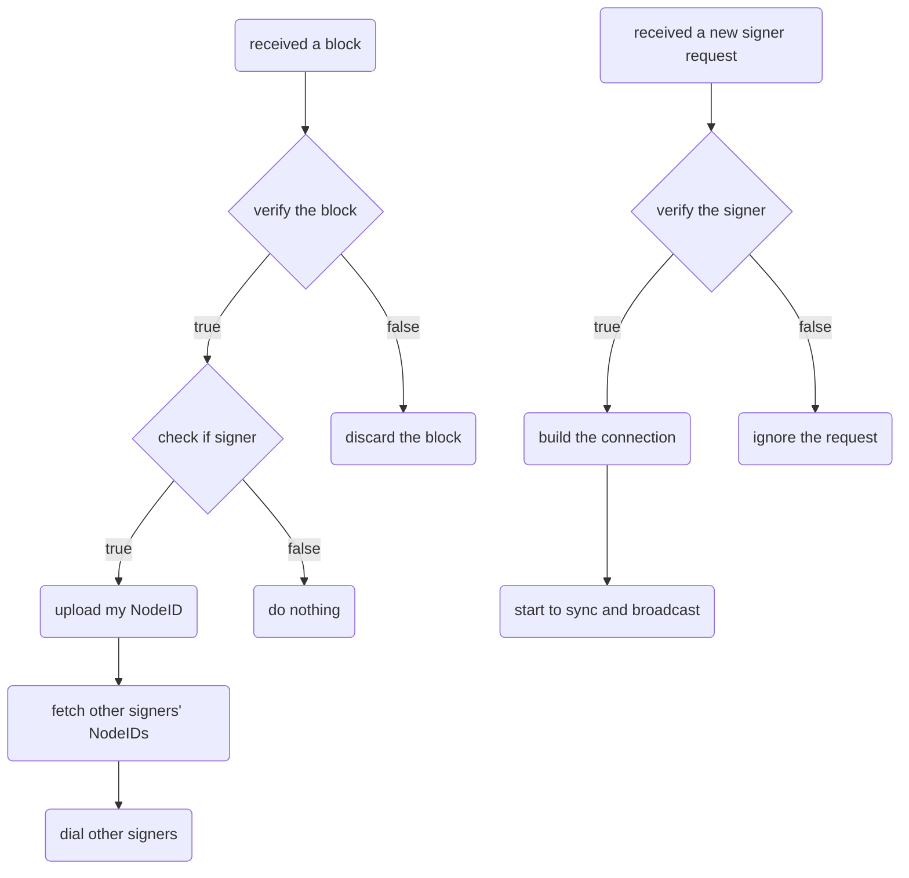

# DPoR - Dynamic Proof of Reputation, a PBFT based consensus protocol

## Keywords

    consensus protocol, PBFT, reputation calculaction.

## Introduction

* PBFT based
* Reputation Calculation involved
* Dynamic Committee
* Round Robin style
* ViewChange with empty block

## Terminology

* Committee
    a group of signers

* Signer
    sign a block to make it legal

* Leader
    generate a block and broadcast to all signers

* Epoch
    epoch is the committee size
    epoch index is the index of different committee

* Round
    round is the index of a signer in a committee

* View
    view is the number of blocks a signer can generate in a committee

## Consensus

1. Consensus States

    * New Round
    * Preprepared
    * Prepared
    * Committed
    * Final Committed

2. State Transitions

    ```mermaid
    graph LR;
        A(NewRound)-- #1 -->B;
        B(Preprepared)-- #2 -->C;
        C(Prepared)-- #3 -->D;
        D(Committed)-- #4 -->E;
        E(FinalCommitted)-- #5 -->A;
    ```

    #1
    the leader generated the block and broadcasted to all signers
    a signer received the propragated block, validated basic fields of the block, then sign it and broadcast prepare msg.

    #2
    a signer received enough prepare msg, then broadcast commit msg.

    #3
    a signer received enough commit msg, then try to insert into chain.

    #4
    a signer inserted the block into local chain.

    #5
    a signer broadcasted the block to all of his normal peers.

3. Leader Selection(View Change in PBFT)

4. Committee Election

5. Reputation Calculation

## Architecture

* Call Graph



## Committee Network Building



## More Designs (11-15)

1. demand

    secure, decentralize, scalable, efficient

2. design

    there are two steps before a new block being added to some peer's local chain,
    the first is block generating, and second is block validation.

    we would like to assign those two tasks to different committe to aquire better
    security performance and higher throughput while losing some less important
    features like decentralize and scalable in business scenario.

3. detail

    A. Normal Case

    1. block generating

        1. A user claims campaign and enters the candidate list.
        2. After periodically election, a candidate enters a block generator committee.
        3. A block generator encrypts his nodeID with validator committee's public key
            to a contract.
        4. Validators in valitator committee try to connect the block generator with his
            nodeID.
        5. A block generator generates a block and broadcasts to validators.

    2. block validation

        1. Once received a generated block, a block validator in validator committee tries
            to validate the block. If true, broadcast prepare msg to other validators.
        2. Once received enough prepare msg, a block validator broadcasts commit msg to
            other validators.
        3. Once received enough commit msg, a block validator tries to insert the block into
            local chain.

    B. Abnormal Cases And Handling

    1. Block generator not responding.
        Block validator committee generates a block and handle this as like received a
        generated block from block generator.

    2. Block generator do evil.
        1. If the generator generates a wrong block, handle it as not received a block
            at given time window.
        2. If the generator generates multi wrong blocks, same as above.
        3. If the generator generates multi valid blocks, a validator only signs one
            block, and the block with enough signatures is valid, if there is no valid
            blocks at given time point, handle it as block generator not responding.

    3. There are faulty block validators in the validator committee.
        1. If the number of total faulty block validators is less than 1/3, the pbft
            model can handle this as normal pbft consensus process.
        2. If the number of total faulty block validators is large than 1/3, the pbft
            model will not work as expected.

    C. Committee Selection

    1. Block generator committee is elected based on rpts of candidates and a random seed
    derived from block hash.

    2. Block validator committee is the combination of CPC Fundation nodes and other registed
    nodes from govs or coms.

4. liveness and safety

    liveness
        the liveness of block generator committee is guaranteed by above 3.B.1
        the liveness of block validator committee is guaranteed by above 3.B.3

    safety
        the safety of block generator committee is guaranteed by above 3.B.2
        the safety of block validator committee is guaranteed by above 3.B.3
