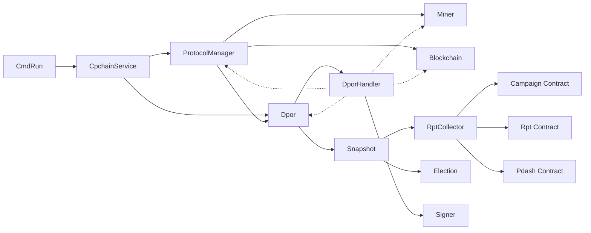
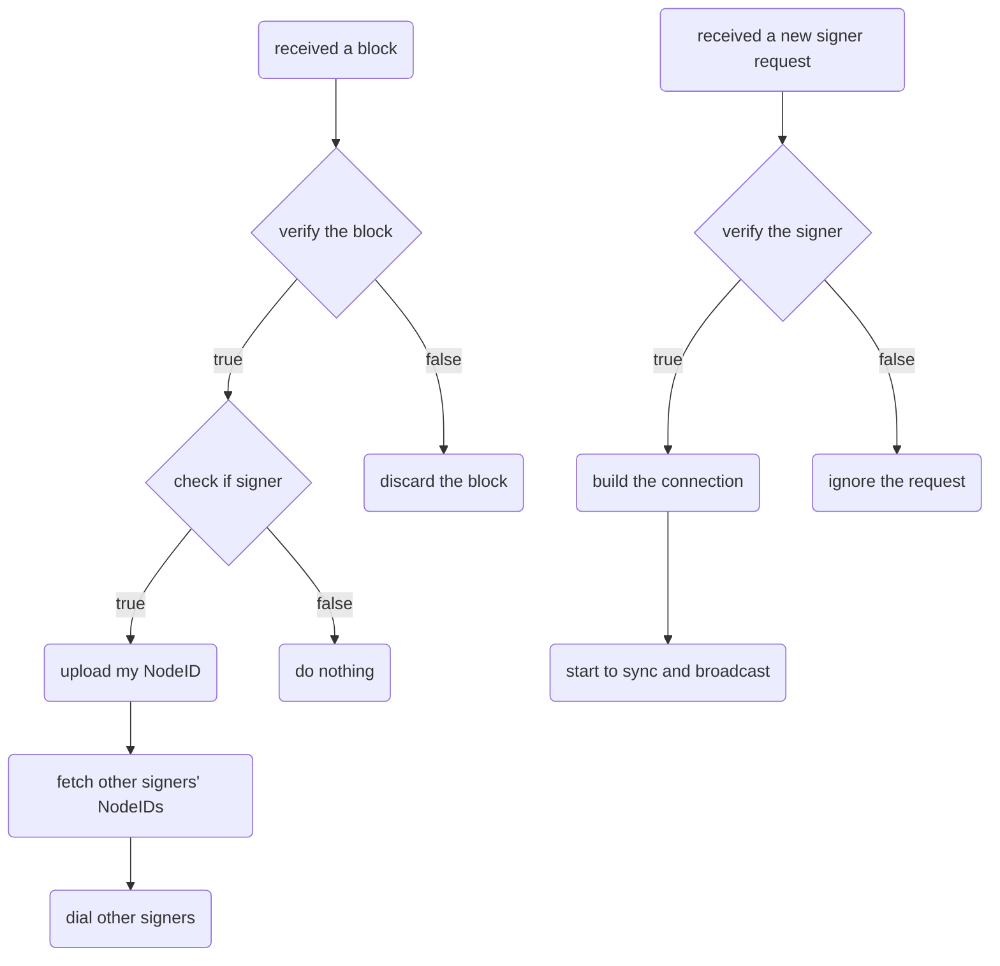

# DPoR - Dynamic Proof of Reputation, a PBFT based consensus protocol

## Keywords

    consensus protocol, PBFT, reputation calculaction.

## Introduction

* PBFT based
* Reputation Calculation involved
* Dynamic Committee
* Round Robin style
* ViewChange with empty block

## Terminology

* Committee
    a group of signers

* Signer
    sign a block to make it legal

* Leader
    generate a block and broadcast to all signers

* Epoch
    epoch is the committee size
    epoch index is the index of different committee

* Round
    round is the index of a signer in a committee

* View
    view is the number of blocks a signer can generate in a committee

## Consensus

1. Consensus States

    * New Round
    * Preprepared
    * Prepared
    * Committed
    * Final Committed

2. State Transitions

    ```mermaid
    graph LR;
        A(NewRound)-- #1 -->B;
        B(Preprepared)-- #2 -->C;
        C(Prepared)-- #3 -->D;
        D(Committed)-- #4 -->E;
        E(FinalCommitted)-- #5 -->A;
    ```

    #1
    the leader generated the block and broadcasted to all signers
    a signer received the propragated block, validated basic fields of the block, then sign it and broadcast prepare msg.

    #2
    a signer received enough prepare msg, then broadcast commit msg.

    #3
    a signer received enough commit msg, then try to insert into chain.

    #4
    a signer inserted the block into local chain.

    #5
    a signer broadcasted the block to all of his normal peers.

3. Leader Selection(View Change in PBFT)

4. Committee Election

5. Reputation Calculation

## Architecture

* Call Graph



## Committee Network Building

