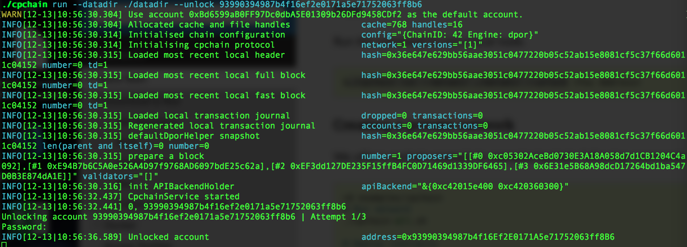
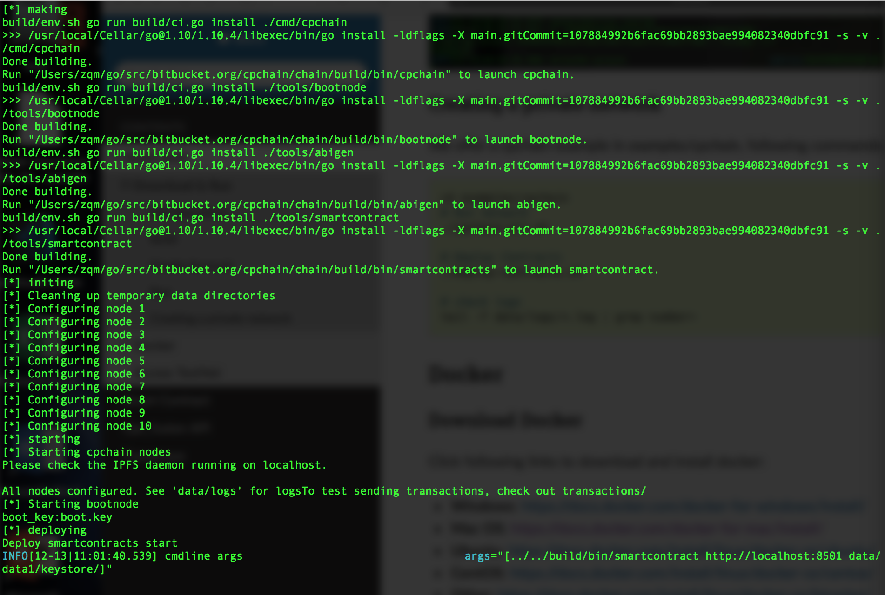

Quick Start
=====================

In this section, you will learn how to download our code, build the project and run it on you own system. You can create a private network or access our Testnet.

.. NOTE:: All code starting with a ``$`` is meant to run on your terminal.
    All code starting with a ``>>>`` is meant to run in a python interpreter,
    like `ipython <https://pypi.org/project/ipython/>`_.

Download & Run
-----------------

First, make sure you have installed `go <https://golang.org/>`_, and configured the $GOPATH.

Get Repository
**************

You can click `here <https://github.com/CPChain/chain>`_ to access source code, or execute the following commands to clone code on github.

.. code::
    
    # open a $GOPATH
    $ cd $GOPATH/src

    # TODO: if module name be changed..., or using go.mod
    $ mkdir -p bitbucket/cpchain/
    
    $ cd bitbucket/cpchain
    
    # TODO: chain url
    $ git clone https://github.com/CPChain/chain

Build
********

Run the command to compile and generate binary file in the `chain` directory.

.. code::

    $ cd chain
    $ make clean
    $ make all

You can find several executables in `build/bin` directory after build the project.

.. code::

    $ cd build/bin
    $ ls

========  ============
Command   Description
========  ============
cpchain   Executable for the cpchain blockchain networks
--------  ------------
abigen    Source code generator to convert CPChain contract definitions into easy to use, compile-time type-safe Go packages. 
--------  ------------
bootnode  A lightweight bootstrap node to aid in finding peers in private networks.
========  ============

Create Account
***************

Run following commands to create a cpchain's account.

.. code::

    $ cd build/bin
    $ ./cpchain account new --datadir ./datadir

.. image:: create_account.png

Run
*****

Run the command to run a local node. 

.. code::

    $ ./cpchain run --datadir ./datadir --unlock <You Address>

Creating A Private Network
***************************

We offer a cpchain example in `examples/cpchain`, following commands:

.. code::

    $ cd examples/cpchain
    # Run network
    $ ./cpchain-all.sh

.. code::

    # check logs
    $ tail -f data/logs/*.log | grep number=

.. image:: log.png

Docker
------------

Download Docker
****************

Click following links to download and install docker:

+ **Windows**: https://docs.docker.com/docker-for-windows/install/
+ **Mac OS**: https://docs.docker.com/docker-for-mac/install/
+ **Ubuntu**: https://docs.docker.com/install/linux/docker-ce/ubuntu/
+ **CentOS**: https://docs.docker.com/install/linux/docker-ce/centos/
+ **Other**: https://docs.docker.com/install/linux/docker-ce/binaries/

Pull Image
***********

.. code::

    # TODO: Publish Docker Image
    $ docker pull ..

Run
******

.. code::

    # TODO: docker-compose.yml
    # open source folder
    $ cd docker/docker-compose
    $ docker-compose up -d

Access Testnet
----------------

Connect to our Testnet. There is our bootnodes'address:

.. code::

    1. enode://...@xx.xx.xx.xx:xxxx
    2. enode://...@yy.yy.yy.yy:yyyy
    ...

Start your cpchain node:

.. code::

    $ ./cpchain run --datadir ./datadir --unlock <You Address> --bootnode <bootnodes>

.. image:: TestNet.png

