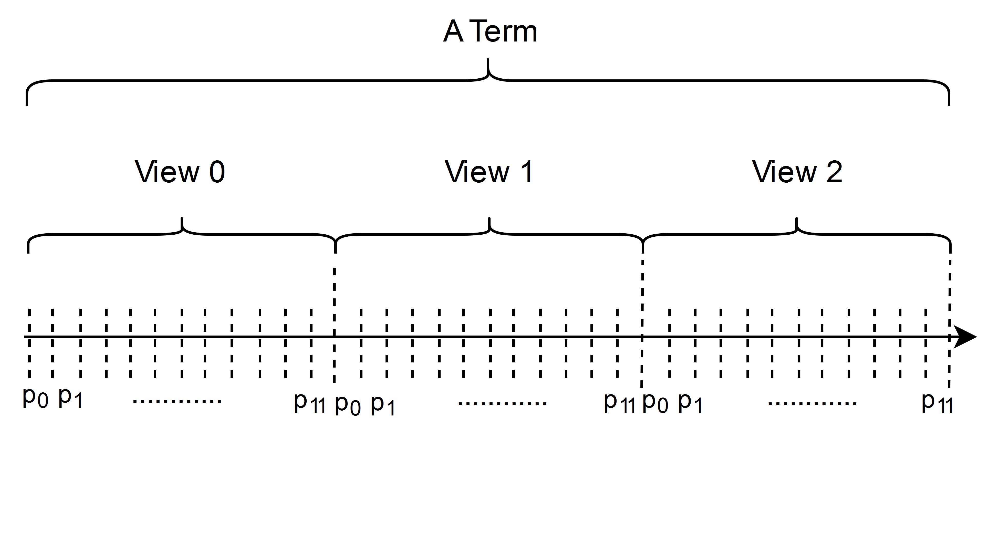

.. _election:

Election
===============

Principles and Steps
+++++++++++++++++++++

In election, a certain number of candidates (referred as *seats*) are elected to be proposer
according to their RPT value.
We have the following principles to design the election:

#. An RNode with higher RPT has higher chance to be elected;
#. Each term of proposers has a certain number of representatives from RNodes with low RPT.

Thus, the basic steps of election process are:

#. Candidates are divided into two partitions, high-RPT RNodes and low-RPT RNodes;
#. Either partition has a number of available seats;
#. The probability mass for each node being elected is proportional to its RPT in its corresponding partition;
#. Random select nodes in two partitions, which together constitute proposers committee.

Pseudocode of Election
+++++++++++++++++++++++

Let :math:`TotalRnode` be the number of all RNode candidates,
:math:`TotalSeats` be the number of seats for each term,
:math:`LowRptPercentage` be the percentage of low-RPT RNdoes in all RNode candidates,
and :math:`LowRptSeats` be available seats for low-RPT RNodes.
The equation :math:`0\leq LowRptPercentage\leq 1` and
:math:`0\leq LowRptSeats\leq LowRptPercentage \times TotalSeats \leq TotalSeats` always hold.

In current implementation, :math:`LowRptPercentage` is :math:`50\%`,
and :math:`LowRptSeats` occupies one fourth of :math:`TotalSeats`.

.. code-block:: go

    // rptList is the list of all candidates as well as their RPT value
    // seed is the seed for generating random numbers
    // tha value of seed is the hash value of the parent block
    func elect(rptList, seed, TotalRnode, TotalSeats, LowRptPercentage, LowRptSeats) []address {
        // sort rptList
        sort.Sort(rptList)

        var partition uint64
        partition = LowRptPercentage * TotalRnode
        // partition rptList into lowRpts and highRpts
        lowRpts := rptList[:partition]
        highRpts := rptList[partition:]

        // generate a series of random numbers given the seed
        randSource := rand.NewSource(seed)
        myRand := rand.rand.New(randSource)

        lowElected := randomSelectByRpt(lowRpts, myRand, partition, LowRptSeats)
        highElected := randomSelectByRpt(highRpts, myRand, TotalRnode - partition, TotalSeats - LowRptSeats)
        return append(lowElected, highElected)
    }

    // uniform random selection from rptPartition
    // the mass probability for each node being elected is proportional to its RPT
    // the function select l random addresses
    // and return them as result
    func randomSelectByRpt(rptPartition, myRand, k, l) []address {
        if (k < l) {
            return all k addresses
        }
        // each element in rptPartition is referred as rpt
        // then we sum all rpt values, as sumRpt
        // using myRand to random select l addresses according to its rpt/sumRpt
        // return these l addresses
    }

The Structure of Term
++++++++++++++++++++++++

Each **term** consists of 12 proposers and 36 blocks sealed by these proposers.
The order of proposals is scheduled in the form of *Round Robin*,
which is shown in the following figure.
Each term consists of three identical *views*,
in which 12 proposers seal blocks one by one.

