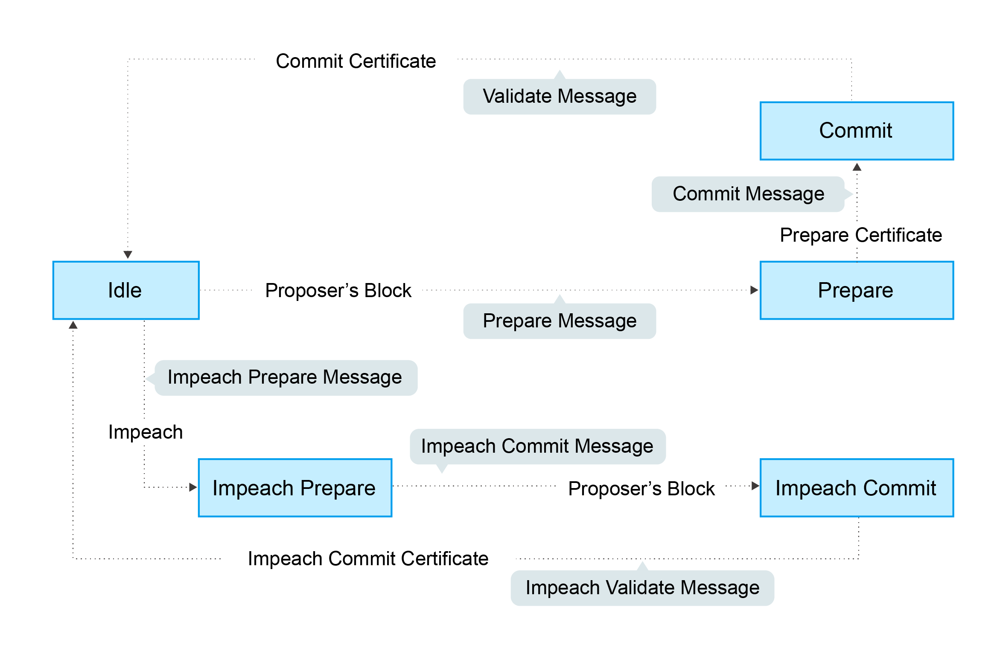
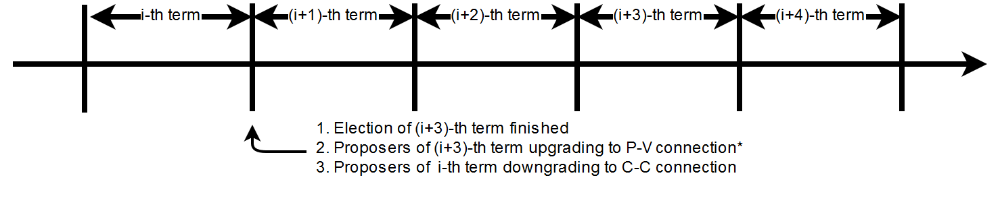

# Implementation

## Finite State Machine

The LBFT 2.0 protocol can be considered as a finite state machine (FSM)
with 5 states: **idle**, **prepare**, **commit**, **impeach prepare**
and **impeach commit**. The former three states are designed for normal
cases, and the rest are specializing in handling abnormal cases.

The illustration below demonstrates these five states as well as
transitions between states.

::: tip

Not all transitions are shown in this figure due to the lack of space.
:::

The text on an arrow between two states refers to the condition of this
transition. And the message box near the arrow represents the message
broadcast to other nodes.



## LBFT 2.0 Pseudocode 

For more detailed implementation, interested reader can refer to the
pseudocode below (the grammar is close to golang).

### FSM for LBFT 2.0 

> ``` {.go}
> // a general code for LBFT FSM
> func LbftFsm20(input, state) {
>     switch state{
>     case idle:
>         idleHandler(input)
>     case prepare:
>         prepareHandler(input)
>     case commit:
>         commitHandler(input)
>     case validate:
>         validateHandler(input)
>     case impeachPrepare:
>         impeachPrepareHandler(input)
>     case impeachCommit:
>         impeachCommitHandler(input)
> }
> ```

### Utilities

> ``` {.go}
> // period is the minimal time between two consecutive blocks
> // timeout is used for whether the timer expires
> var period, timeout int
> period = 10 * time.Second   // set period as 10 seconds
> timeout = 10 * time.Second  // set timeout as 10 seconds
>
> // sign is a slice storing signs of a given block header
> // prepareSignatures stores signs of prepare messages for a given block header
> var prepareSignatures map[header]sign
>
> // commitSignatures stores signs of commit messages for a given block header
> var commitSignatures map[header]sign
>
> // refresh signatures
> func refreshPrepareSignatures(input) {
>     // Retrieve the block header of given message
>     header := header(input)
>     if input contains signs that are not stored in prepareSignatures[header]{
>         append these signs into prepareSignatures[header]
>     }
> }
>
> func refreshCommitSignatures(input) {
>     // Retrieve the block header of given message
>     header := header(input)
>     if input contains signs that are not stored in CommitSignatures[header]{
>         append these signs into CommitSignatures[header]
>     }
> }
>
> // compose a prepare message
> func composePrepareMsg(input) *Header{
>     // Retrieve the block header of given message
>     ret := header(input)
>     compose a message based on ret
>     // added its own sign into the message
>     append the sign of this validator into PrepareSignatures[ret]
>     return ret
> }
>
> // compose a commit message
> func composeCommitMsg(input) *Header{
>     // Retrieve the block header of given message
>     ret := header(input)
>     compose a message based on ret
>     // added its own sign into the message
>     append the sign of this validator into CommitSignatures[ret]
>     return ret
> }
>
> // implementation of composing impeach messages are identical to normal cases' counterparts
> func composeImpeachPrepareMsg(input) *Header{
>     return composePrepareMsg(input)
> }
>
> func composeImpeachCommitMsg(input) *Header{
>     return composeCommitMsg(input)
> }
>
> // compose a validate message
> // note that it returns block
> func composeValidateMsg(input) *Block{
>     // retrieve the block from the cache with its seal
>     return block.WithSeal(input)
> }
>
> // determine whether a quorum certificate is sufficed
> func prepareCertificate(input) bool{
>     if (len(prepareSignatures[header]) >= 2f+1) {
>         return true
>     }
>     return false
> }
>
> func commitCertificate(input) bool{
>     if (len(commitSignatures[header]) >= 2f+1) {
>         return true
>     }
>     return false
> }
>
> func impeachPrepareCertificate(input) bool {
>     if (len(prepareSignatures[header]) >= f+1) {
>         return true
>     }
>     return false
> }
>
> func impeachCommitCertificate(input) bool {
>     if (len(commitSignatures[header]) >= f+1) {
>         return true
>     }
>     return false
> }
>
> // cacheBlock is invoked to cache a block if necessary
> func cacheBlock(block) {
>     if block is not cached && verifyBlock(block){
>         add block into the cache
>     }
> }
> ```

### Normal Case Handlers

> ``` {.go}
> // handler for validate state
> // it is a quasi state for repeating validate message
> // the only valid input is validate message
>
> // it is worth mentioning that the operation broadcast can be executed to two groups of nodes:
> // one is all validators;
> // and the other one is all nodes including validators, civilians and proposers
> // all messages regarding consensus between validators are only sent to validators
> // newBlockMsg, in contrast, is sent to all nodes indicating a block is confirmed validated
> // unless otherwise specified, all broadcast operations are done only for validators
>
> func validateHandler(input) {
>     switch input{
>     // only accept normal case and impeachment validate message
>     case validateMsg, impeachValidateMsg:
>         insert the block
>         broadcast newBlockMsg to all nodes including civilians
>         transit to idle state
>     }
> }
>
> // handler for commit state
> func commitHandler(input) {
>     switch input{
>     // when receive impeachment related messages
>     case expiredTimer, impeachPrepareMsg, impeachCommitMsg, impeachValidateMsg:
>         impeachHandler(input)
>
>     case validateMsg:
>         insert the block
>         // echo of validate message
>         broadcast validateMsg to validators
>         // send out new block message
>         broadcast newBlockMsg to all nodes
>         transit to idle state
>
>     case commitMsg:
>         refreshCommitSignatures(input)
>         if commitCertificate(input) {
>             validateMsg := composeValidateMsg(input)
>             broadcast validateMsg
>             transit to validate state
>         }
>
>     // add the block into the cache if necessary
>     case block:
>         cacheBlock(input)
>
> }
>
> // handler for prepare state
> func prepareHandler(input) {
>     switch input{
>     // when receive impeachment related messages
>     case expiredTimer, impeachPrepareMsg, impeachCommitMsg, impeachValidateMsg:
>         impeachHandler(input)
>
>     case validateMsg, commitMsg:
>         commitHandler(input)
>
>     case prepareMsg:
>         refreshPrepareSignatures(input)
>         if prepareCertificate(input) {
>             // it is possible for suffice two certificates simultaneously
>             if commitCertificate(input) {
>                 validateMsg := composeValidateMsg(input)
>                 broadcast validateMsg
>                 transit to validate state
>             } else {
>                 broadcast prepareMsg    // transitivity of certificate
>                 commitMsg := composeCommitMsg(input)
>                 broadcast commitMsg     // with its signature
>                 transit to commit state
>             }
>         }
>     }
> }
>
> // handler for idle state
> func idleHandler(input) {
>     switch input{
>     // when receive impeachment related messages
>     case expiredTimer, impeachPrepareMsg, impeachCommitMsg, impeachValidateMsg:
>         impeachHandler(input)
>
>     case validateMsg, commitMsg, prepareMsg:
>         prepareHandler(input)
>
>     case block:
>         if !verifyBlock(block) {
>             propose an impeach block
>             append its own signature into prepareSignatures[header(b)]
>
>             // a cascade of determination of certificate
>             if impeachPrepareCertificate(b) {
>                 if impeachCommitCertificate(b) {
>                     impeachValidateMsg := composeValidateMsg(input)
>                     add the impeach block b into cache
>                     broadcast impeachValidateMsg
>                     transit to validate state
>                 } else {
>                     impeachPrepareMsg := composeImpeachPrepareMsg(input)
>                     impeachCommitMsg := composeImpeachCommitMsg(input)
>                     add the impeach block b into cache
>                     broadcast the impeachPrepareMsg
>                     broadcast the impeachCommitMsg
>                     transit to impeachCommit state
>                 }
>             } else {
>                 impeachPrepareMsg := composeImpeachPrepareMsg(input)
>                 add the impeach block b into cache
>                 broadcast the impeachPrepareMsg
>                 transit to impeachPrepare state
>             }
>         } else {
>
>             // a cascade of determination of certificates
>             if prepareCertificate {
>                 if commitCertificate {
>                     validateMsg := composeValidateMsg(input)
>                     add block into the cache
>                     broadcast validateMsg
>                     transit to validate state
>                 } else {
>                     prepareMsg := composePrepareMsg(input)
>                     commitMsg := composeCommitMsg(input)
>                     add block into the cache
>                     broadcast prepareMsg
>                     broadcast commitMsg
>                     transit to commit state
>                 }
>             } else {
>                 prepareMsg := composePrepareMsg(input)
>                 add block into the cache
>                 broadcast prepareMsg
>                 transit to prepare state
>             }
>         }
>     }
> }
> ```

### Impeachment Handlers

> ``` {.go}
> // handler for impeach commit state
> func impeachCommitHandler(input) {
>     switch input{
>     case validateMsg:
>         insert the block
>         broadcast validateMsg
>         broadcast newBlockMsg to all nodes
>         transit to idle state
>
>     case impeachValidateMsg:
>         insert impeach block
>         broadcast impeachValidateMsg
>         broadcast newBlockMsg to all nodes
>         transit to idle state
>
>     case impeachCommitMsg:
>         refreshCommitSignatures(input)
>         if impeachCommitCertificate(input) {
>             impeachValidateMsg := composeValidateMsg(input)
>             broadcast impeachValidateMsg
>             transit to validate state
>         }
>     }
> }
>
> // handler for impeach prepare state
> func impeachPrepareHandler(input) {
>     switch input{
>     case validateMsg, impeachValidateMsg, impeachCommitMsg:
>         impeachCommitHandler(input)
>
>     case impeachPrepareMsg:
>         refreshPrepareSignatures(input)
>         // it is possible to suffice two impeach certificates
>         if impeachPrepareCertificate(input) {
>             if impeachCommitCertificate(input) {
>                 impeachValidateMsg := composeValidateMsg(input)
>                 broadcast impeachValidateMsg
>                 transit to validate state
>             } else {
>                 impeachCommitMsg := composeImpeachCommitMsg(input)
>                 broadcast impeachPrepareMsg // transitivity of certificate
>                 broadcast impeachCommitMsg
>                 transit to impeachCommit state
>             }
>         }
>     }
> }
>
> // a general impeachment message handler for normal case states
> func impeachHandler(input) {
>     switch input{
>     case expiredTimer:
>         propose an impeach block b
>         append its own signature into prepareSignatures[header(b)]
>
>         // a cascade of determination of certificate
>         if impeachPrepareCertificate(b) {
>             if impeachCommitCertificate(b) {
>                 add the impeach block b into cache
>                 impeachValidateMsg := composeValidateMsg(input)
>                 broadcast impeachValidateMsg
>                 transit to validate state
>             } else {
>                 add the impeach block b into cache
>                 impeachPrepareMsg := composeImpeachPrepareMsg(input)
>                 impeachCommitMsg := composeImpeachCommitMsg(input)
>                 broadcast the impeachPrepareMsg
>                 broadcast the impeachCommitMsg
>                 transit to impeachCommit state
>             }
>         } else {
>             impeachPrepareMsg := composeImpeachPrepareMsg(input)
>             add the impeach block b into cache
>             broadcast the impeachPrepareMsg
>             transit to impeachPrepare state
>         }
>
>     case impeachPrepareMsg, impeachCommitMsg, impeachValidateMsg:
>         impeachPrepareHandler(input)
>     }
> }
> ```

## Cascade of Determination of Certificates 

A cascade of determination of certificates refers to a phenomenon that a
message can suffice more than one certificate.

Recall an example in `func idleHandler()` in [LBFT 2.0
Pseudocode](#lbft-20-pseudocode). A block adds one distinct signature in
`prepareSignatures`, which is possible to suffice a prepare certificate.
Under the case that a prepare certificate is collected, one more
distinct signature is added in `commitSignatures`, it is also possible
that a commit certificate can be collected.

``` {.go}
func idleHandler(input) {
    switch input{
    // some code here
    case block:
        // some code here

        // a cascade of determination of certificates
        if prepareCertificate {
            if commitCertificate {
                add block into the cache
                broadcast validateMsg
                transit to validate state
            } else {
                add block into the cache
                broadcast prepareMsg
                broadcast commitMsg
                transit to commit state
            }
        } else {
            add block into the cache
            broadcast prepareMsg
            transit to prepare state
        }
    // some code here
    }
}
```

A similar cascade of determination also applies in impeach handlers. An
example is `func impeachHandler()` as shown below.

``` {.go}
func impeachHandler(input) {
    switch input{
    case expiredTimer:
        propose an impeach block
        // a cascade of determination of certificate
        if impeachPrepareCertificate(b) {
            if impeachCommitCertificate(b) {
                add the impeach block b into cache
                broadcast impeachValidateMsg
                transit to validate state
            } else {
                add the impeach block b into cache
                broadcast the impeachPrepareMsg
                broadcast the impeachCommitMsg
                transit to impeachCommit state
            }
        } else {
            add the impeach block b into cache
            broadcast the impeachPrepareMsg
            transit to impeachPrepare state
        }

        // some code here
    }
}
```

## Transitivity of Certificate 

Readers may notice comments in [LBFT 2.0
Pseudocode](#lbft-20-pseudocode) referring to transitivity of
certificate. An example of `func prepareHandler()` is demonstrated
below.

``` {.go}
func prepareHandler(input) {
    switch input{
    // some code here

    case prepareMsg:
        if prepareCertificate {
            // some code here
            broadcast prepareMsg    // transitivity of certificate
            broadcast commitMsg
            transit to commit state
        }
    }
}
```

When a validator suffices a prepare certificate, it does not only
broadcast the commit message with its signature, it but also sends out
the prepare certificate it just collects. The essence of a prepare
certificate is $2f+1$ prepare signatures (or $f+1$ impeach prepare
signatures). Thus, by sending out the broadcast a prepare message with
all signatures it collects, other validators can obtain the certificate.

The motivation of introducing this mechanism is to implement
[Intra-block Recovery](#intra-block-recovery). And by utilizing prepare
message, we can implement it without adding too much code.

## Optimizations

### Echo of Block

Once a node is elected, it will try to connect to all validators and
maintain the connections until it seals all blocks. However, this
connection may be lost. Thus, we introduce an echo of block, such that
all connected validators repeat its received block from the proposer to
all other validators.

Since we can tolerate at most $f$ faulty validators, $f+1$ connected
validators can guarantee that at least one loyal validator can assume
the responsibility to repeat the block. (We assume that connections
between validators, i.e., [V-V](#v-v) connections are all stable.) But,
if the proposer cannot connect to enough validators, it will also
broadcast the block at the last moment as the last resort.

Here we list the work validators and proposers need to do.

**Validator:**

1.  Broadcast the block to all validators if it receives a block from
    the proposer.
2.  This broadcast is only done once for each distinct block.
3.  No matter whether it receives the block from other validators or
    proposer, add the block into cache and launch normal LBFT 2.0
    consensus process.

**Proposer:**

1.  It runs a busy-waiting loop within a time window to continuously
    check how many validators are still connected.
2.  Once the number is no less than $f+1$, it broadcasts the block to
    all connected validators.
3.  If the number is always below $f+1$ in this time window, broadcast
    the block to all connected validators right after the time window
    ends.

### Echo of Validate Message

Echo of validates message refers to a mechanism in implementation that a
validator echoes a validate message when it receives it for the first
time. A validator does not insert a block, no matter a normal or impeach
one, until it receives a validate message. This statement is valid even
if a validator $v$ sends out a validate message itself. Validator $v$
can only insert the block after it hears the echo from other validators.

The reason of introducing echo is to get rid of depending on one single
validator broadcasting a validate message. In an edge case, a validate
can lose its connection while broadcasting a validate message. If there
were no echo mechanism, this edge case would sabotage the consistency of
LBFT 2.0, since only a proportion of nodes could receive this validate
message.

Instead of trivially repeating validate message, we introduce a quasi
state named as **validate** state. The word *Quasi* here indicates that
validate state is not a real state like idle state. It does not
contribute on consensus process, neither is compulsory. It serves as
following roles:

> 1.  A distinct state corresponding to validate message.
>
> 2.  Preventing a validator handling any messages from previous block
>     height.
>
> 3.  A counter to make sure that each validator only broadcasts
>     validate message only once.
>
> 4.  
>
>     Partitioning original validate messages into two sets:
>
>     :   a.  Validate messages between validators committee.
>         b.  Validate messages broadcasts to all civilians (renamed as
>             **New Block** message).

When a validator collects a commit certificate, the following operations
are being executed:

> 1.  It enters validate state, and broadcasts a validate message to the
>     validators committee.
> 2.  After it receives validate message from another validator, it
>     broadcasts a new block message to all nodes including civilians.
> 3.  It enters idle state for the next block height.

For validators that have not suffice a commit certificate yet, it works
as follows:

> 1.  
>
>     If it receives a validate message, it broadcasts out two messages:
>
>     :   a.  validate message to all validators
>         b.  new block message to all civilians
>
> 2.  It enters idle state for the next block height.

Apparently, only validators that have collected a validate certificate
can enter validate state. The total number of validators in validate
state can be larger than one, since all validators and its message
processing are running in parallel. Other validators directly enters
idle state after receiving a validate message.

### Timing of Constructing an Impeach Block

As demonstrated in [LBFT 2.0 Pseudocode](#lbft-20-pseudocode), a
validator does not construct an impeach block unless it is necessary,
like receiving an expiredTimer.

But in practice, a validator construct an impeach block in its idle
state even if it has yet received any message. This impeach block is the
one broadcast to other if the validator enters impeach handler. And it
is discarded if the validator reaches a consensus on the normal case
handler.

The rationale behind this design is:

1.  Utilize the idle time waiting for a message.
2.  The timestamp of the impeach block is written a future one.

The second reason is the main motivation. For a certain block height,
the timestamp of an impeach block is predefined. Let $t_1$ be the
timestamp of this impeach block. As we know the normal case handler
terminates before $t_1$. Thus, we can treat this block as an
[Unknown Ancestor Block](./consensus.md#unknown-ancestor-block), and reuse the
code to handle the impeach block, which involves less new code as well
less latent risks.

### Minimum P2P Connections

One notable thing is that a validator does not proceed until it connects
to $2f$ validators. In other word, the committee contains a strongly
connected component of at least $2f+1$ validators. It is aiming to
eliminates a situation where two separated components of more than $f+1$
validators form two weak quorum simultaneously.

## Recovery

LBFT 2.0 provides both liveness and safety under the assumption that at
most one third of validators misbehave in a certain block height. But
without providing a recovery mechanism, the percentage of faulty
validators would accumulate, outnumber one third, and finally degrade
superior safety of LBFT 2.0. It motivates us to develop a sophisticated
recovery mechanism, such that a delaying validator can catch up others.

Delaying validators are categorized into two different types according
to how far behind they are:

1.  The block height of delaying validator is same as the functioning
    validators
2.  The validator delaying for at least a block height.

### Intra-block Recovery

Under the original framework of LBFT 2.0, once a validator loses its
connection for a state, it can hardly join the consensus process at the
rest part of this block. Here we give an example.

**Example 1:** validator $v_1$ from a committee of four members,
disconnects from the network in the prepare state. The other three
validators suffice a quorum for a prepare certificate and proceed to
commit state. Even $v_1$ somehow reconnects to the net, it cannot
contribute to collect a commit certificate in this block height, since
it has yet collected a prepare certificate missed prepare messages from
others.

Without any recovery, $v_1$ would be regarded as a non-responding node,
and return to normal consensus processing in the next height, after it
receives a validate message. The intra-block recovery address the
problem by appending the certificate to the message. Applying
intra-block recovery in Example 1, the other three validators broadcast
a commit message accompanied with a prepare certificate. Validator $v_1$
can forward to commit state after it verifies the certificate.

Some readers may wonder that LBFT 2.0 works perfectly as long as the
assumptions are kept, what the necessity of intra-block recovery is. The
key reason is that communications between validators are finished in the
blink of an eye. The possibility that a validator loses some packets is
not that low. Our experimental results indicate that even in a committee
of four loyal validator, one of them faces the problem that it lags
behind one state every hundreds of blocks.

In practice, we use a prepare message with all signature the validator
collects, as the certificate. Refer to [Transitivity of Certificate](#transitivity-of-certificate) for detailed implementation.

By introducing intra-block recovery, our system can tolerate two or more
distinct validators lose their connection in different states. Even
though this scenario violates our original assumptions, LBFT 2.0 with
intra-block recovery reaches a consensus. At the cost of larger space
consumption for each message, we increase the robustness of the
protocol.

### Extra-block Recovery

If intra-block recovery does not work for a validator $v$ and the block
height of $v$ is same as the chain, it is about to catch up other
validators once it receives a validate message. As demonstrated in
[LBFT 2.0 Pseudocode](#lbft-2-0-pseudocode), validate message (as
well as impeach validate message) has highest priority, which forwards
$v$ to idle state of next height regardless of the state of $v$.

However, if $v$ has been losing its connection for a long time, it
should invoke *sync* function. Sync function, as indicated by the name,
synchronizes with Mainnet chain. Then it can rejoin consensus process
after receiving validate message of the current height. The function is
called a validator suspects it is delaying like receiving
[Unknown Ancestor Block](./consensus.md#unknown-ancestor-block).

### Restore Cache

Once a block is validated and inserted into the chain, it can be
labelled as a permanent data. And all permanent data are written in hard
disks. In comparison, information like current state, collected
signatures as well as block caches are temporary data. As temporary data
are stored in volatile memory, they are not retained once a validator
shuts down or restarts. Hence, before a validator shuts down, it writes
all temporary data in hard disk, and retrieves these data after it
starts up.

Note that it is highly possible that a validator is lagging behind other
committee members after it restarts. In this case, it processes the
block as explained in [Unknown Ancestor Block](./consensus.md#unknown-ancestor-block).

## Failback

Failback is a process to restore the whole system after if all
validators halt at the same time. Apparently, the chain has to be
suspended since no validator can continue working on consensus. The main
challenge here is to reach a consensus for the first block after all
validators reboot.

From the proposer's perspective, it has no clue when the validation
system can restore. Thus, the first block right after the reboot of
validators, must be an impeach block to regain liveness.

As we described in [Impeachment](./consensus.md#impeachment), the
timestamp of an impeach block is determined by previous block. In the
scenario of failback, we cannot use the equation
$previousBlockTimestamp+period+timeout$ to calculate the timestamp,
since this timestamp is out of date. It motivates us to design a
mechanism to reach a consensus on the issue of timestamp among
validators whose local clocks are not consistent.

We are aiming to fulfil two main objectives:

1.  Reach a consensus on an impeach block with consistent timestamp
2.  Do not design extra states of validators.

The second objective is to keep simplicity as well as robust of the
system. By exploiting existent five states to reach a consensus on
timestamp, we could reduce the risk of introducing new mechanism.

### Preliminaries

Let $t_i$ be the local clock of validator $v_i$. Except for assumptions
of LBFT 2.0, several more assumptions are required for failback
procedure. There exist a timestamp $T$ larger than 0 satisfying
following assumptions:

> 1.  The local clocks of all loyal validators (at least $2f+1$) are
>     within an interval of $T$.
> 2.  Maximum possible delay of broadcasting messages is less than
>     $T/2$.
> 3.  All validators restart within a time window of $T/2$.

The first assumption can be also interpreted as $\max(t_i - t_j) < T$.
We name it as the sample space of validators. This assumption is
reasonable since all loyal validators are connecting to the network and
get their local clock calibrated before reboot.

Now we construct a set of discrete timestamps
$TS=\{t|t=2k\times T, \text{k is a natural number}\}$. A validator $v_i$
chooses timestamp $ts$ for the failback impeach block, satisfying

1.  $ts_i$ is an element of $TS$.
2.  $ts_i > t_i$.

After reboot, all validators are set to idle state. When the local clock
of $v_i$ is $ts_i$ , it proposes an impeach block with this timestamp,
and enters impeach prepare state. If it cannot collect an impeach
prepare certificate at $ts_i + 2T$, $v_i$ proposes another impeach block
with timestamp $ts_i + 2T$. The rest of consensus part are same as LBFT
2.0.

The coefficient 2 in $2T$ is derived from the second and third
assumptions. Thus, each validator can receive messages from all other
validators within a time window of $T$.

In practice, $T$ can be set to be 1 minutes. Hence, the system can
regain its liveness in 4 minutes. The pseudocode is shown below.

### Failback Pseudocode

> ``` {.go}
> // this function can only be invoked when reboot
> func failback () {
>     // v: a validator
>     // t: local clock of v in Unix timestamp
>     T := 1 * time.Minute // 1 minutes
>     set the state to idle state
>
>     // timestamp of failback impeach block
>     Ts1 := (t/(2*T)+1)*2*T
>     // the timestamp if no certificate collected for Ts1
>     Ts2 := Ts1+2*T
>
>     select{
>         case <- Time.after(Ts1)
>             LBFTFsm20(expiredTimer, idle)
>         case <- Time.after(Ts2)
>             LBFTFsm20(expiredTimer, idle)
>     }
>
> }
> ```

This approach guarantees that an impeach block can reach validate state
within a time of at most $2T$. To prove the correctness of the
algorithm, we will discuss several cases.

### Correctness

**Theorem 2:** *Function* `failback` *guarantees that validators
committee can reach a consensus on an impeach block within* $4T$ *time.*

**Proof:** Let $v_i$ represent $i$-th validator, and $t_i$ be its local
clock timestamp. Construct a set
$TS=\{t|t=2k\times T, \text{k is a natural number}\}$. Select three
elements $ts_0$ , $ts_1$ and $ts_2$ from $TS$, satisfying
$ts_2  = ts_1  + 2T = ts_0  + 4T$, $ts_0  < \min(t_i)$, and
$ts_2 > \max(t_i)$.

Here we introduce two subsets of validators, $V_1$ and $V_2$. $V_1$ is
made of all validators whose local clocks are smaller than $ts_1$, and
$V_2$ is made of all validators whose local clocks are large than or
equal to $ts_1$.

Here we discuss different cases according to the cardinalities of $V_1$
and $V_2$.

**Case 1:** $|V_2| = 0$.

It means all local clocks of loyal validators are between two timestamp
$ts_1$ and $ts_2$. This is the simplest scenario. all validators agree
on $ts_1$ . And the system will insert the impeach block right after
$f+1$ validators passes $ts_1$.

Thus, the validators committee can collect an impeach certificate at
$ts_1$ .

**Case 2:** $|V_1 | >= f + 1$, and $|V_2 | < f + 1$.

It means there are at least $f+1$ validators whose local clocks are
smaller than $ts_1$, but less than $f+1$ validators with their local
clock larger than or equal to $ts_1$. It is similar to case 1. Despite
some validators agree on $ts_2$ , they cannot constitute a quorum. When
$f+1$ validators from $V_1$ passes $ts_1$, the system will insert an
impeach block.

Thus, the validators committee can collect an impeach certificate at
$ts_1$ .

**Case 3:** $|V_1 | < f + 1$, and $|V_2| >= f + 1$.

It means there are no more than $f+1$ validators whose local clocks are
smaller than $ts_1$, but at least $f+1$ validators with their local
clock larger than or equal to $ts_1$. In this case, when $f+1$
validators from $V_2$ reaches timestamp $ts_2$, an impeach block
certificate can be collected by all online validators.

Thus, the validators committee can collect an impeach certificate at
$ts_2$.

**Case 4:** $|V_1 | < f + 1$, and $|V_2 | < f + 1$.

In this case, validators in $V_1$ cannot suffice a certificate for
$t_1$. Because at least we have loyal $f+1$ validators online, the
equation $|V_1|+|V_2| \geq f+1$ must hold. When time flows, validators
in $V_1$ gradually pass timestamp $ts_2$ . And these validators propose
another impeach block agreeing on $ts_2$ . Thus, there exists a subset
$V_1'$ of validators in $V_1$ such that $V_1$ reaches $ts_2$ and
$|V_1'|+|V_2| \geq f+1$.

Let $ts_3$ be the next timestamp in $TS$ after $ts_2$, i.e.,
$ts_3 = ts_2 + 2T$. As we can see, the validator with largest local
timestamp has not reached $ts_3$ yet. At this moment, $V_1'\cup V_2$
suffices a quorum for an impeach block agreeing on $ts_2$.

Thus, the validators committee can collect an impeach certificate at
$ts_2$ .

**Case 5:** $|V_1| >= f + 1$, and $|V_2 | >= f + 1$.

At first glance, it seems impeach block of either $ts_1$ and $ts_2$ is
legal. However, validators in $V_1$ reaches $ts_1$ earlier than
counterparts in $V_2$ reaching $ts_2$ . The reason is simple, as the the
following equation indicates:
$ts_2  - \max(t_i) \geq ts_1   + 2T - (\min(t_i )+T)
\geq ts_1  - \min(t_i)$.

Thus, the validators committee can collect an impeach certificate at
$ts_1$ .

By summing up above five cases, we can conclude that the theorem holds.
**Q.E.D**

## P2P Hierarchy

As we know all nodes in blockchain network are connecting with each
other via P2P method. Each node holds a list of peers that it can
directly connects To enhance connection between committee members, we
design a hierarchy of P2P connection according to the roles of peers.

### Overview

When a node kick-starts CPC and connects to bootnode, it receives a list
of peers, whose amount is usually 25. Via edges between this nodes and
its peers, it now connects to the P2P network.

As described in [Consensus](./consensus.md#consensus), there are
three roles in a consensus process. Thus, in total we have 9 possible
P2P connection types according to the roles of two peers. And we refers
to each type in the form of A-B, where A and B can be V, P or C, Like
P-V refers to P2P connections from P to V.

However, some P2P types in practice do not to be distinguished from each
other. Like for civilians, they have no need to distinguish connections
from other civilians, or a committee member.

The table below presents all possible connections and four distinct
types, as well as the number of peers a node holds.

<table cellspacing="0" cellpadding="5">
	<tr>
		<th colspan="1"> P2P types     </th>
		<th colspan="1"> Validator   </th>
		<th colspan="1"> Proposer     </th>
		<th colspan="1"> Civilian  </th>
	</tr>
	<tr>
		<td  rowspan="1"> Validator </td>
		<td  rowspan="1"> V-V </td>
		<td  rowspan="1"> P-V </td>
		<td  rowspan="1"> C-C </td>
	</tr>
	<tr>
		<td  rowspan="1"> Proposer </td>
		<td  rowspan="1"> V-P </td>
		<td  rowspan="1"> C-C </td>
		<td  rowspan="1"> C-C </td>
	</tr>
	<tr>
		<td  rowspan="1"> Civilian </td>
		<td  rowspan="1"> C-C </td>
		<td  rowspan="1"> C-C </td>
		<td  rowspan="1"> C-C </td>
	</tr>
</table>

### C-C

C-C is the basic P2P connection type. It serves as the normal P2P
connection, providing basic functions like receiving blocks and syncing
with the chain. It holds the lowest priority among all P2P connections.
Hence C-C connections are the first choice to be removed from the peer
list due to the lack of storage.

### P-V

P-V is the third layer in P2P hierarchy. When an RNode is elected as a
proposer for a further term, it will insert addresses of all validators
into its list of peers, and upgrade the connection to P-V. Refer to
[Upgrade and Downgrade](#upgrade-and-downgrade) for details. The address
of validators, unlike other addresses, will not be kicked out from the
list of peers as long as it yet proposes the block.

### V-P

V-P is the second layer in the hierarchy. Once a C-C connection is
upgrading to P-V, validator also upgrade it to V-P. Similar to P-V
connection, as long as a connection retains as P-V, it will be removed
from peer list.

### V-V

V-V is the highest layer in the hierarchy. P2P connections between two
validators are always V-V, and will never be removed from peer list.

### Upgrade and Downgrade

To prevent unnecessary communication overheads, a C-C connection gets
updated to P-V or V-P only when necessary.



*\*: only proposers do not in* $(i+1)$, $(i+2)$ *and* $(i+3)$ *-th term
are getting downgraded.*

The illustration above shows how a connection gets upgraded and
downgraded. At the moment that the $i$-th term finishes, all proposers
of $(i+3)$-th term have been elected. And following operations are under
execution:

1.  Proposers of $(i+3)$-th term adds non-redundant validators addresses
    into its peer list.
2.  Then, upgrade these connections with validators to P-V.
3.  Validators adding these proposers of $(i+3)$-th into its peer list
    as V-P connections.
4.  Proposers of $i$-th term downgrade all P-V connections to C-C, if
    they are not in any future term.

This upgrade process finishes within a term. Thus, all proposers of
$(i+3)$-th hold P-V connections with validators in $(i+2)$-th term.

And if the peer list has no vacancy for new addresses, a proposer or
validator randomly picks some C-C connection addresses, and remove them.
