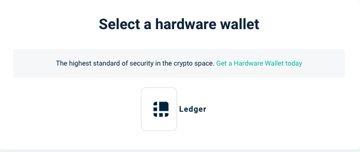
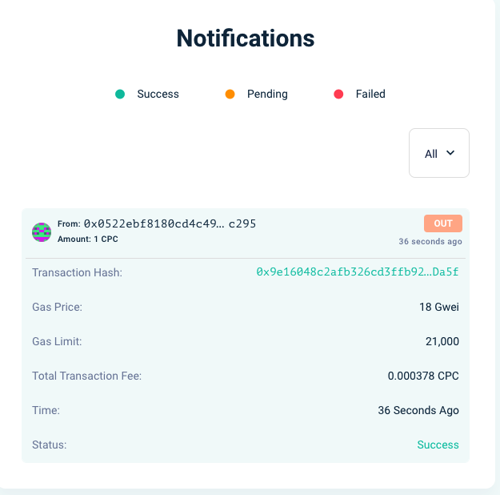

# Ledger Nano S and Nano X

This document describes how to set up a [Ledger Nano S](https://shop.ledger.com/products/ledger-nano-s) or [Ledger Nano X](https://shop.ledger.com/pages/ledger-nano-x) with the [Ledger Live](https://www.ledger.com/ledger-live) software.

Once the setup steps shown below are complete and the [CPChain app](https://github.com/CPChain/app-cpchain) is installed on your Nano device, users have several options of how to use the Nano to interact with the CPChain Network.

## Getting Started

+ Order a [Nano S](https://shop.ledger.com/products/ledger-nano-s) or [Nano X](https://shop.ledger.com/pages/ledger-nano-x) from Ledger.
+ Follow the instructions for device setup included in the package, or [Ledger's Start page](https://www.ledger.com/start/)
+ Install [Ledger Live desktop software](https://www.ledger.com/ledger-live/)
  + If you already have Ledger Live installed, please update to the latest version of Ledger Live, which enables the newest firmware and app updates.
+ Connect your Nano to your computer and follow the on-screen instructions.
+ Update the firmware on your new Nano. This is needed to ensure you are able to install the latest version of the Solana App.
  + [Update Nano S Firmware](https://support.ledger.com/hc/en-us/articles/360002731113-Update-Ledger-Nano-S-firmware)
  + [Update Nano X Firmware](https://support.ledger.com/hc/en-us/articles/360013349800)

## Install the CPChain App on your Nano

+ Open **Ledger Live**
+ Click on **"Manager"** in the left pane on the app and search for **"CPChain"** in the App Catalog, then click **"Install"**.
  + Make sure your device is plugged in via USB and is unlocked with its PIN
+ You may be prompted on the Nano to confirm the install of CPChain App
+ **"CPChain"** should now show as **"Installed"** in the Ledger Live Manager

## Interact with the CPChain network

CPChain support [Web wallet](https://wallet.cpchain.io) to connect hardware wallet. There is a example for **Ledger Nano S**.

### Open CPChain App on Ledger Nano S

Firstly, please unlock **Ledger Nano S** with PIN. Then open the installed **CPChain App**.

### Connect to Ledger

Open the [Web wallet](https://wallet.cpchain.io)，click **"Access Wallet/Hardware Wallets"** in the header pane.

Then select Ledger, a dialog will prompt. Please click **"Connect"** to connect to the Ledger.

Please click "Unlock wallet".

### Receive CPC

After unlock the wallet, you can see your addresses now. If you want receive crypto coins from others, you can copy a address from the list and send it to him.

### Send CPC

If you want sign a transaction, please confirm the term, then click **"Access my wallet"**.

After that, you can check your balance and set your transaction.

After set the **"Amount"** and **"To Address"**, you can click "Next"（If you want to change the **gasLimit** or the **gasPrice**, please click **"Advanced"**).

There is a dialog will prompt.

Then click **"Confirm & Send"**. Now, your ledger will show the detailed information of the transaction. You can check those information.

1. Review transaction 
2. Check address 
3. Check amount 
4. Check Max fees 
5. Approve 
6. Reject

Finally, you can check the result in **Notifications** if you approve this transaction.

## Troubleshooting

+ Ledger device: INS_NOT_SUPPORTED (0x6d00).
  + Ensuring your device runs the latest firmware version.
  + Reinstalling the apps on your device so you run the latest versions. Uninstalling apps does not affect your crypto assets, that are secured on the blockchain.

## Support

Check out our [Wallet Support Page](../support.md) for ways to get help.
