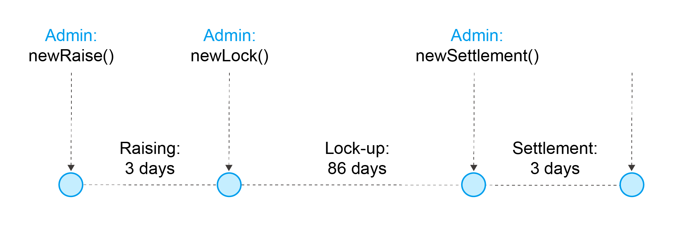

.. _overview:

Overview
===============

What is CPChain
################

CPChain is a new blockchain infrastructure for the next generation IoT.

Built-in Smart Contract
#########################

CPChain comes with 6 built-in smart contracts to ensure normal operations of DPoR.

Proxy Register Contract
*********************************

   Proxy contract addresses and real contract addresses can be bound through function ``registerProxyContract()``.
   Thus, there is no need to modify the address in Go or Solidity when a contract is update.
   The real contract address can be obtained through function ``getRealContract()``.

RPT Contract
***************

   RPT (abbreviated from reputation) contract calculates RNode's reputation value.
   It is a core component of RNode ecosystem.
   `RNode <https://cpchain.io/rnode/>`_ is the detail of the RNode ecosystem.
   Reputation value consists of 5 dimensions,
   **Account Balance (AB)**,
   **Transaction (TX)**,
   **Data Contribution (DC)**,
   **Blockchain Maintenance (BM)**,
   and **Proxy Reputation (PR)**.
   Refer to `RPT Evaluation`_ for detailed implementation.

   By invoking function ``getRpt()``, developer can obtain the reputation value of corresponding node.
   RPT contract can be updated by contract deployer to avoid some faulty nodes maliciously increasing their RPT values.
   The weights of above 5 dimensions can be customized by 5 PRT contract functions
   ``updateAlpha()``,
   ``updateBeta()``,
   ``updateGamma()``,
   ``updatePsi()``,
   and ``updateOmega()``.
   The weight of window size can also be adjusted via the function ``updateWindow()``.

Campaign Contract
********************

   A campaign contract is called once a user starts mining.
   If its passes the test of admission contract,
   it is registered as an RNode by the campaign contract.
   Furthermore, given the condition that RPT value of  the user is one of the top 21 RNodes,
   it is qualified to claim campaign aiming to become one of the committee members.
   In other words, that user acquires an opportunity to insert a block into cpchain and obtain some cpc as rewards.

   Here we list some vital functions in campaign contract.

   ``claimCampaign()``: this function is called when a user claims a campaign.
   A fee paid in cpc is required by campaign contract as a deposit.

   ``quitCampaign()``: this function is called after a user quits the campaign.
   It is about to get its deposit back via this function.

   ``punishCandidate()``: this function can only be invoked by contract deployer.
   The deployer can detain the RNode's deposit if it observes any malicious behavior from an RNode.

   ``candidatesOf()`` and ``candidateInfoOf()``: functions to retrieve RNodes and their information.

Admission Contract
*********************

   Admission contract is called by campaign contract to verify whether
   the candidates' CPU and memory resources match the requirements of mining.
   Two functions ``updateCPUDifficulty()`` and ``updateMemoryDifficulty()``
   are implemented to fulfil this verification purpose.

PDash Contract
****************

   PDash contract is an important app on cpchain, which helps RPT contract to calculate Proxy Reputation.
   You can click `PDash <https://github.com/CPChain/pdash>`_ to get more details.

Register Contract
*******************

   Register contract is used for recoding the upload history of nodes.
   It collaborates with RPT contract to calculate nodes' Data Contribution.

Private Contract
###################

   Our data privacy mechanism allows users to deploy and call private contract on cpchain for completing their
   private transactions in a secure way.
   Besides the agent P (validator and intermediary) and accounts accepted by the deployer,
   others are permitted from viewing the private transactions.
   Although the private transactions are invisible for others who
   are not the transaction's participants, some sophisticated key data is recorded and maintained in blockchain.
   The data is available for audition and validation for private transactions when necessary.

User Scenario Steps
***********************

   1. Seller A registers an item via the private contract CT. An item includes name, ipfs_cid, price, description and so on.

   2. Buyer B checks the registered items on contract CT and chooses some items to buy.

   3. Buyer B pays money to an escrow contract CE.

   4. Buyer B sends contract CT an order describing which item to buy and its public key, the one used to encrypt the item's symmetric key (e.g. AES).

   5. Seller A receives the notification about the order from contract CT, and checks if the buyer have enough money from the escrow contract CE.

   6. Seller A sends contract CT the confirmation message attached with the symmetric key encrypted by the buyer's public key.

   7. Buyer B receives the encrypted symmetric key, and then decrypts it. With the symmetric key, the buyer B can decrypt the data on IPFS and then confirm whether it is what it needs.

   8. The agent P notices the confirmation and transfer money to seller A.

.. image:: process.png

Consensus
#####################

The consensus in LBFT 2.0 is determined by two committees:
**Validators Committee** and **Proposers Committee**,
which together lead to a bipartite committee structure.
Proposers and validators, just as their names imply,
take the responsibility of proposing and validating blocks respectively.

The consensus process works in a finite state machine which consists of five states
**idle**, **prepare**, **commit**, **impeach prepare** and **impeach commit**.
The former three states are designed for normal cases,
and the rest, named as impeachment, are specializing in handling abnormal cases.

Due to the lack of space in this page, we explicate LBFT 2.0 in :ref:`consensus`

RNode Ecosystem
####################

CPChain Nodes Roles and Pools
************************************

**Economy Node**: Requires a minimum of $20,000$ CPC tokens
deposited in *Economy Pool* for participation.
Investors who meet this requirement may participate as
an economy node and have the right to vote in the community.

**Reputation Node**: Requires a minimum of 200,000 CPC tokens
deposited in *Economy Pool* for participation.
Investors with the basic configuration of computing and
storing can participate to support the CPChain Open Transmission Protocol (COTP).

**Industry Node**:
IoT Industry partners and CPChain ecosystem's peer developers have the right to participate as an Industry Node.

Note that there are two separate pools for deposit.

**Economy Pool**:
Any node deposit at least $20,000$ CPC tokens in this pool is qualified as economy node.

**RNode Pool**:
Any node deposit at least $200,000$ CPC tokens in this pool is qualified as RNode.

Reputation Nodes
*****************

A node has to meet one of the following requirements to become a Reputation Node:

    1. Economy node + Computing and Storing node:
    An economy node must lock-up a specific amount of tokens (200,000 minimum and 5,000,000 maximum)
    for 90 days and must satisfy the software, hardware, and network connection requirements.
    The locked up tokens have a positive correlation with the basic rewards.
    Reputation nodes will be refunded after they leave the election.

    2. Industry Node + Computing and Storage Node:
    An industry node will be upgraded to a reputation node once meeting all the hardware,
    software, and network requirements.
    Industry nodes must be verified by the CPChain foundation.

Reputation Nodes have the right to be elected as
a proposers committee member and to be granted rewards from the Blockchain.

RPT Evaluation
*******************************

RPT (abbreviated from reputation) value of a node is evaluated by extracting data from blockchain.
By employing `RPT Contract`_, a node can evaluates its RPT value by following five dimensions:

- **Account Balance（AB)**,
- **Transaction (TX)**,
- **Data Contribution (DC)**,
- **Blockchain Maintenance (BM)**,
- **Proxy Reputation (PR)**.

Each dimension has a full score of 100 point.
And the total score is calculated as:

:math:`RPT = 0.5\times AB +
0.15\times TX +
0.1\times PR +
0.15\times DC +
0.1\times BM`

.. note::

    All scores for each dimension are evaluated within to a time window,
    which is latest 100 blocks.
    Data outside this window are no longer taken into consideration.

Unless otherwise stated,
the score for each dimension is calculated by the same methodology.
In total, there are at most 100 RNodes in each term campaign.
The RNode with :math:`i`-th highest RPT will get :math:`(100-i+1)` score.

Account Balance
++++++++++++++++++

A *account balance* score is granted to an RNode
according to its account balance ranking among all RNode addresses
(excluding CPChain Foundation and Exchange addresses).

Transaction
++++++++++++++

*Transactions* here include
all transactions sent by a given user.
The definition of *transactions* can be expanded as the of CPChain ecosystem develops.

TX score is evaluated by all *transactions* statistics.
The distribution of transactions can follow
a long tail distribution or power laws.

Proxy Reputation
++++++++++++++++++

An RNode can serve as a *proxy* helping other nodes complete transactions.
Its RPT is augmented after assuming the responsibility as a proxy.

Proxy reputation score is calculated according to following rules:

1. Once an RNode registers as a proxy, it obtains 10 initial points.
#. For each successful transaction with the node's help as a proxy, it gets 5 points.
#. The full score is 100 points.

Data Contribution
++++++++++++++++++++

Uploading data augments RPT value.
There are two parts in data contribution,
as basic DC score and bonus DC score.

Data contribution score is calculated according to following rules:

1. For each file an RNode uploads, the node is rewarded 3 points in DC score.
#. The full score of basic DC is 30 points.
#. Each time other node purchases a file that RNode uploads, the RNode is rewarded 5 bonus points.
#. The full score of bonus DC is 70 points.

Blockchain Maintenance
+++++++++++++++++++++++++

Blockchain Maintenance score is calculated
given a node's contribution in proposing a certain block.

Hardware Specification
***************************

Minimum Requirement
++++++++++++++++++++++++

* Memory: 4GB

* Storage: 256GB

* CPU: Intel Xeon E5-1650 v3 (alike)

* Network: 300Mbps

Recommended Requirement
++++++++++++++++++++++++++

- Memory: 16GB

- Storage: 1TB

- CPU: Intel Xeon E5-2686 v4 (alike)

- Network: 1Gbps

Node Entitlements & Rewards
*******************************

CPChain's ecosystem is established by a lot of Internet of Things (IoT) enterprises, developers and users.
It is a long-term process.
As a result, CPChain will divide the incentive system into two stages.
In the first stage, CPChain Foundation would be the main fund provider,
for the ecosystem establishment and the chain maintenance.
The next stage is mainly performed by the market.
With the optimization of CPChain ecosystem and the increase in data sharing and transferring,
the reward for RNodes will mainly be generated by smart contracts and market transactions.

In the first stage, reputation nodes' entitlements will be allocated to two parts:

Basic Rewards
+++++++++++++++++

CPChain will create a reward pool with 5 million CPC annually (1.25 million CPC quarterly, 13,700 CPC daily).
The Economy Nodes receive the corresponding CPC reward
based on the ratio of the locked margin to the total margin.
(Economy Node needs a 90-day lock-up session).
The detailed process goes as follows:

Each season contains 90 days, which is also named as **lock-up period**.
There are 7 special days served as **fundraising** ahead of each lock-up period.
Each fundraising is overlapped with previous lock-up period.
In fundraising, the following operations are allowed:

1. All civilians can deposit coin in the reward pool, to become Economy Nodes.
#. Nodes that have already had coins deposited in the pool can choose to
    1. whether continue deposit the next season
    #. or renew the deposit value.
#. For a node determines to withdraw deposit, it needs to call withdraw function on their own initiative after lock-up period finishes.

When a fundraising ends, the following rules are applied:

1. No one adjusts or withdraw its deposit until next fundraising.
#. Nodes that decide to withdraw the deposit, receive the coins.
#. Any node that renews its deposit balance get recalculated whether it is an Economy Node or not.
#. All nodes with deposit in this lock-up period receive their reward from the pool.

The reward for a certain node from the pool is proportional to its deposit in a season.
In other word, the basic reward is calculated as :math:`5000000 \cdot d/D`, where :math:`d` is deposit of a certain node,
and :math:`D` is the total value of coins in the reward pool.

Maintenance Reward
+++++++++++++++++++++

Proposers committee nodes are entitled to blockchain maintenance rewards,
after it proposes a block and successfully gets it inserted into the chain.
As defined in `the RNode ecosystem <https://cpchain.io/rnode/>`_,
the annual supply from maintenance is 40 million CPC in the first year,
and being decreased by 25% annually for the next four years.
Thus, the annual supply for five years is 40 million, 30 million, 22.5 million,
17 million and 12.75 million respectively.
After five years, the supply runs out. In other words, no CPC is rewarded after that time.

Meanwhile, CPC Mainnet inserts a block every 10 seconds, which yields around 3 million blocks each year.
Therefore, we conclude the reward and supply in the table below.

+--------+--------+---------------+--------------+
| Year   | Reward | Num of Blocks |   Supply     |
+========+========+===============+==============+
| 1      | 12.65  |  3,162,240*   | 40,002,336   |
+--------+--------+---------------+--------------+
| 2      | 9.51   |  3,153,600    | 29,990,736   |
+--------+--------+---------------+--------------+
| 3      | 7.13   |  3,153,600    | 22,485,168   |
+--------+--------+---------------+--------------+
| 4      | 5.39   |  3,153,600    | 16,997,904   |
+--------+--------+---------------+--------------+
| 5      | 4.03   |  3,162,240*   | 12,743,827.2 |
+--------+--------+---------------+--------------+

\* Both the first and the fifth year contain a leap day (29 Feb 2020 and 2024, respectively),
which results in a larger number of generated blocks compared to the other three years.

Note that in our LBFT 2.0 protocol,
an impeach block in inserted into the chain if the proposer is faulty or non-responding.
Intuitively, a faulty proposer cannot receive the reward. Hence, the amount of annual supply could be smaller than the
one listed in the table above.

Lock Deposit
***************

Use smart contracts to lock deposit, the functions are as follow:

    Determine the node level based on the amount of deposit of the node.
    lock the deposit to fixed range of length of blockchain.
    Reward distribution according to proportion of node's deposits.
    Connection with Reputation list.

Execution Fee - Gas System
############################

All operations in CPC is not conducted free.
An amount of tokens are cost as operation fees,
whose unit is denoted by **Gas**.
Gas is measured by the amount of computational overheads when executing a certain operation.
Every single operation, no matter transaction or smart contract,
is executed along with gas deducted.

Here we list important definitions:

1. **Gas**, the unit measuring execution fee.
#. **Gas Limit**, the maximum gas the applicant willing to pay.
#. **Gas price**, the amount the applicant pays for each unit of gas.

Gas
******

Gas is a special unit, measuring the amount of computational overheads when executing a certain operation.
Every operation is associated with an fixed number of gas,
indicating the computational effort of this operation.

All gas-consuming operations are curated in ``configs/protocol_params.go``.
An instance is shown below,
demonstrating the value of gas of a non-smart-contract transaction and creating a smart contract.

.. code-block:: go

	// Per transaction not creating a contract.
	// NOTE: Not payable on data of calls between transactions.
	TxGas                 uint64 = 21000
	// Per transaction that creates a contract.
	// NOTE: Not payable on data of calls between transactions.
	TxGasContractCreation uint64 = 53000

Thus, a normal transaction requires 21,000 gas,
while a smart contract is created at a cost of 53000 gas.

Gas Limit
*************

Gas limit, as its name indicates,
refers to the maximum gas a node is going to pay in a transaction.
Apparently, the equation :math:`gas \leq gasLimit` always holds.
It limits the upper bound of transaction fees in a contract,
and avoid a contract involving unexpectedly high gas.
This kind of situation occurs when an error, like too much loops,
is embedded in the contract.

Gas limit is tunable parameter when a node applies for a transaction.
We also offer a default setting for it,
preventing the node from being drained out.

Gas Price
*************

Gas price is the fee for each gas a node pays.
By analogy, gas is like gallon when fueling a car.
Gas limit is the fuel tank of the car, limiting maximum gas.
And gas price is the petroleum price per gallon.
Thus, the total fee for a transaction is :math:`gas \times gasPrice`.

When a node applies for a transaction,
the system calculates a gas price based on transaction history on the chain.
However, gas price is also tunable.
A node can define gas price at any value as long as it can afford it.
Transactions with high gas price have higher chance being selected by committee,
and further get inserted into the chain.
But it expenses more for the node.
In comparison, a low gas price demands low cost of tokens,
by sacrificing the possibility of being verified by committee.

Fee Calculation
*****************

The fee of a certain transaction is :math:`gas \times gasPrice`.
However, for smart contract transaction involving multiple operations,
fee cannot be determined until the whole transaction terminates.
Thus, when a node applies for a transaction,
it is required to pay :math:`gasLimit \times gasPrice` tokens.
And after the transaction terminates,
unused fee :math:`(gasLimit-gas) \times gasPrice` is refunded to this node.

Note that transaction fee as :math:`gas \times gasPrice` is not refundable.
Even the transaction fails, like an abnormal contract involving gas outnumbering gas limit,
the system does not refunds deducted fee.
The rationale is that committee members have assumed their responsibility of
verifying this transaction at the cost of their computing overheads,
which should be rewarded with transaction fee.
In addition, this mechanism avoids malicious nodes
occupying computing capability of the chain at no cost.

